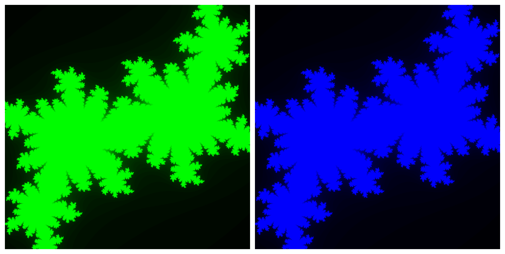

- [Vulkan Compute Shader](#vulkan-compute-shader)
  * [Windows Users](#windows-users)
  * [Prerequisites (Linux)](#prerequisites-linux)
  * [Project 1: hello-vkinfo](#project-1-hello-vkinfo)
  * [Project 2: hello-validation](#project-2-hello-validation)
  * [Project 3: hello-surface](#project-3-hello-surface)
  * [Project 4: hello-fractal](#project-4-hello-fractal)

# Vulkan Compute Shader

## Windows Users

Install the [Vulkan SDK](https://vulkan.lunarg.com/) (only required for debugging) and Visual Studio, and then open `vulkan-compute-shader.sln`.

## Prerequisites (Linux)

Install vcpkg:

```
$ sudo apt install build-essential pkg-config cmake curl zip unzip tar ninja-build
$ sudo apt install libxinerama-dev libxcursor-dev xorg-dev libglu1-mesa-dev
$ sudo apt install libxrandr-dev libxi-dev

$ git clone https://github.com/microsoft/vcpkg.git
$ cd vcpkg
$ ./bootstrap-vcpkg.sh
$ echo 'export VCPKG_ROOT=$HOME/vcpkg' >> ~/.bashrc
$ echo 'export PATH=$PATH:$VCPKG_ROOT' >> ~/.bashrc
$ source ~/.bashrc
$ vcpkg integrate install
```

Install vulkan-validationlayers for debugging:

```
$ sudo apt install vulkan-validationlayers
```

## Project 1: hello-vkinfo

This project prints out the Vulkan API version and available GPUs and supported Vulkan versions.

```
$ cd hello-vkinfo
$ cmake -B build --preset vcpkg
$ cmake --build build
$ ./build/hello-vkinfo
```

Output:

```
Vulkan API version: 1.3.296

Number of physical devices: 2

Available devices:
Device name: Intel(R) Arc(TM) Graphics
Device type: Integrated GPU
API version: 1.3.277

Device name: NVIDIA RTX 1000 Ada Generation Laptop GPU
Device type: Discrete GPU
API version: 1.3.277
```

## Project 2: hello-validation

To debug Vulkan applications, you need to install the Vulkan SDK and enable validation layers.

```
$ cd hello-validation
$ cmake -B build --preset vcpkg
$ cmake --build build
$ ./build/hello-validation
```

Output:

```
Available extensions:

VK_KHR_surface
VK_KHR_win32_surface
VK_KHR_external_memory_capabilities
VK_KHR_external_semaphore_capabilities
VK_KHR_external_fence_capabilities
VK_KHR_get_physical_device_properties2
VK_KHR_get_surface_capabilities2
VK_KHR_device_group_creation
VK_EXT_swapchain_colorspace
VK_EXT_debug_utils
VK_KHR_display
VK_KHR_get_display_properties2
VK_KHR_surface_protected_capabilities
VK_EXT_debug_report
VK_EXT_direct_mode_display
VK_EXT_surface_maintenance1
VK_NV_external_memory_capabilities
VK_KHR_portability_enumeration
VK_LUNARG_direct_driver_loading

Validation layers available

Validation layer: windows_get_device_registry_files: GUID for 5 is not SoftwareComponent skipping
Validation layer: windows_get_device_registry_files: GUID for 6 is not SoftwareComponent skipping
Validation layer: Searching for ICD drivers named .\igvk64.dll
Validation layer: Searching for ICD drivers named .\nvoglv64.dll
Validation layer: Loading layer library D:\VulkanSDK\1.4.304.1\Bin\.\VkLayer_khronos_validation.dll
Validation layer: Loading layer library C:\Windows\System32\DriverStore\FileRepository\nvdm.inf_amd64_6471f03c03d2b425\.\nvoglv64.dll

...

Validation layer: Unloading layer library C:\Windows\System32\DriverStore\FileRepository\nvdm.inf_amd64_6471f03c03d2b425\.\nvoglv64.dll
Validation layer: Unloading layer library D:\VulkanSDK\1.4.304.1\Bin\.\VkLayer_khronos_validation.dll

D:\vulkan-compute-shader\x64\Debug\hello-validation.exe (process 9640) exited with code 0 (0x0).
To automatically close the console when debugging stops, enable Tools->Options->Debugging->Automatically close the console when debugging stops.
```

## Project 3: hello-surface

This project prints out the surface capabilities of each physical device.

```
$ cd hello-surface
$ cmake -B build --preset vcpkg
$ cmake --build build
$ ./build/hello-surface
```

Output:

```
Available devices:
Device name: NVIDIA GeForce RTX 2080 Ti
Device type: Discrete GPU
API version: 1.3.280

Queue families: 5
  Queue count: 16| Graphics | Compute | Transfer | Sparse binding  [ Present Support ]
  Queue count: 2| Transfer | Sparse binding
  Queue count: 8| Compute | Transfer | Sparse binding  [ Present Support ]
  Queue count: 1| Transfer | Sparse binding | Video Decode
  Queue count: 1| Transfer | Sparse binding | Video Encode
```

## Project 4: hello-fractal

This project calculates the fractal on CPU and GPU, respectivily.

```
$ cd hello-sim-fractal
$ cmake -B build --preset vcpkg
$ cmake --build build
$ ./build/hello-fractal
```



Output:
```
Number of physical devices: 2

Available devices:

Device name: Intel(R) Arc(TM) GraphicsDevice type: Integrated GPUAPI version: 1.3.277
Queue families: 4
  Queue count: 1 | Graphics | Compute | Transfer | Sparse binding
  Queue count: 1 | Compute
  Queue count: 1 | Transfer
  Queue count: 2 | Video Decode

Device name: NVIDIA RTX 1000 Ada Generation Laptop GPUDevice type: Discrete GPUAPI version: 1.3.277
Queue families: 6
  Queue count: 16 | Graphics | Compute | Transfer | Sparse binding
  Queue count: 2 | Transfer | Sparse binding
  Queue count: 8 | Compute | Transfer | Sparse binding
  Queue count: 1 | Transfer | Sparse binding | Video Decode
  Queue count: 1 | Transfer | Sparse binding | Video Encode
  Queue count: 1 | Transfer | Sparse binding | Optical Flow

Choose a physical device:
Device index from 0 to 1:
1
Chosen Device 1
Found 6 queue families
CPU fractal: 236.100000 ms.
GPU fractal: 1.890000 ms.
```
